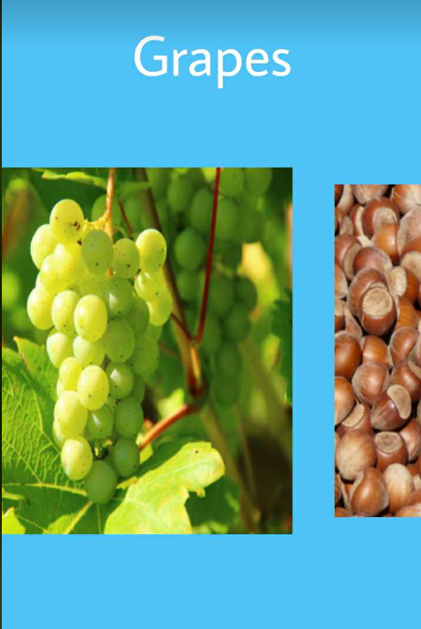
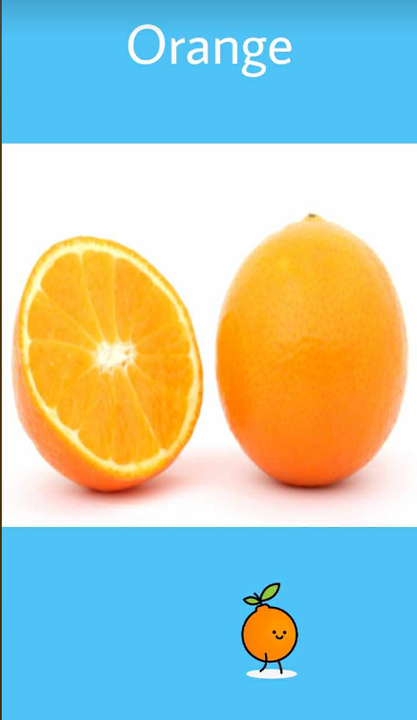

# Fruit Mobile App

**Description**

A simple mobile app compatible with iOS and Android

**Goal of the app**

The app was built in order to teach children various fruits using images and audio

**Functionality**

1.Slide left and right to explore different kinds of fruits 
2.Touch the images for audio 
2.Animation of walking orange when user is inactive

